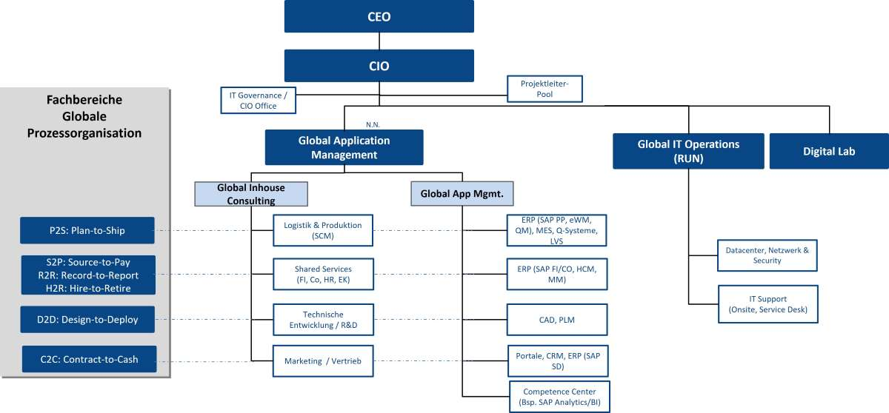
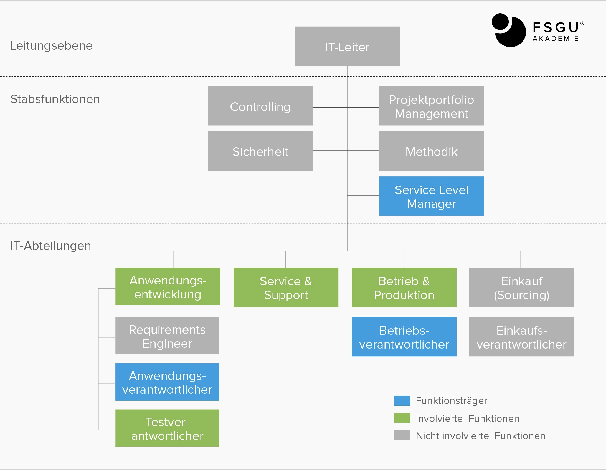

# Aufgabenblatt 1

## Aufgabe 1
### Aufgabe 1.1 - Was versteht man unter IT-Management?
- IT-Management bezieht sich auf die Planung, Koordinierung, Implementierung und Überwachung von IT-Ressourcen und -Aktivitäten innerhalb einer Organisation. 
- Aufgaben:
  - Strategieentwicklung
  - Ressourcenallokation
  - Technologieauswahl und Implementierung
  - Sicherheit und Comliance
  - Betrieb und Wartung
  - Change-Management
  - Performance Monitoring und Optimierung

### Aufgabe 1.2 - Welche Bedeutung hat IT-Management für (mittelständische) Unternehmen? Welche Ziele verfolgt man wohl damit?
- IT-Management spielt eine große Rolle in mittelständischen Unternehmen, da diese eine wesentliche Komponente für den Erfolg und das Wachstum eines Unternehmens darstellt.
- Ziele wären bspw.:
  - Effizienzsteigerung
  - Kostenoptimierung
  - Verbesserung der Wettbewerbsfähigkeit
  - Risikomanagement
  - Geschäftswachstum
  - Compliance
  - Kundenzufriedenheit

## Aufgabe 2
### Aufgabe 2.1 - Welche Aufgaben hat ein(e) IT-Leiter(in) im Unternehmen?
- Ein IT-Leiter leitet, unterstützt und verwaltet verschiedene Systeme und Prozesse der IT-Infrastruktur.
- Darunter fällt das Projektmanagement, Personalmanagement, Budget und Ressourcenverwaltung sowie das Vorgeben einer passenden IT-Strategie.

### Aufgabe 2.2 - Ein(e) IT-Leiter(in) wird auch als „CIO“ bezeichnet. Was bedeutet dieses Akronym und warum setzt es sich wohl im organisatorischen Sprachgebrauch immer weiter durch?
- Chief Information Officer: Eine Person welche für die gesamte IT in einem Unternehmen verantwortlich ist.
- Die Bezeichnung verbreitet sich, da die IT insgesamt eine immer wichtigere Rolle für viele Unternehmen spielt.

### Aufgabe 2.3 - Generell spricht man auf der Top-Führungsebene vom sogenannten „C-Level“. Welche C-Level-Positionen gibt es noch? Recherchieren Sie.
- CEO: Chief Executive Officer
- CFO: Chief Financial Officer
- COO: Chief Operating Officer
- CTO: Chief Technology Officer
- CMO: Chief Marketing Officer
- CHRO: Chief Human Resources Officer
- CCO: Chief Compliance Officer
- CSO: Chief Strategy Officer

## Aufgabe 3
### Nützliche Ressourcen
- https://www.johanning.de/it-organisation/

### Aufgabe 3.1 - Welche Aufgaben werden durch eine IT-Organisation in einem Unternehmen grundsätzlich erbracht?
- Informations und Systemsicherheit
- Technologiesupport
- Prozessautomatisierung
- Management und Wartung von IT Systemen
- Anbieter und Lieferantenmanagement
- Anwendungsentwicklung

### Aufgabe 3.2 - Zeigen Sie Beispiele grundsätzlicher Aufbauorganisationen, die Sie recherchieren konnten (zur Leitung vgl. Aufgabe 2).
- https://www.johanning.de/it-organisation/

- https://www.fsgu-akademie.de/lexikon/it-organisation/
